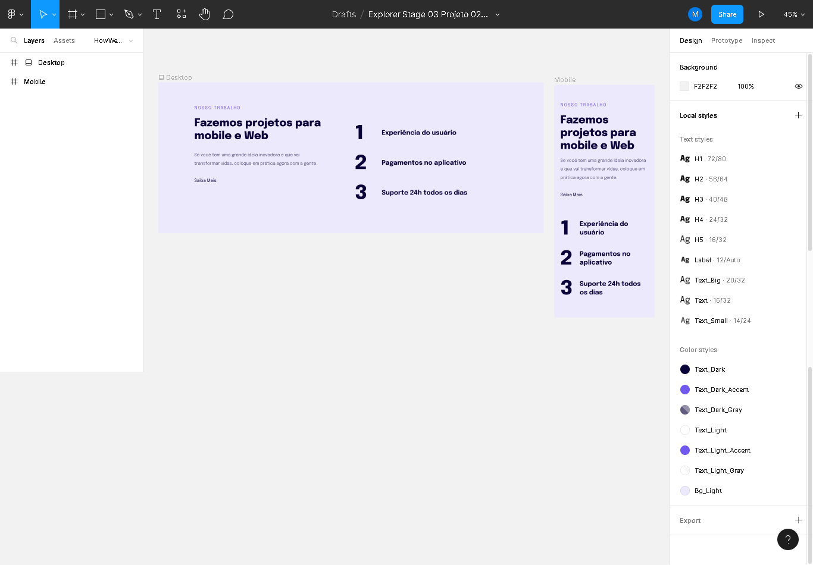

## 🚀 Rockeatseat 
<h1>Stage 03 - Avançando no HTML e CSS</h1>

<h3>Aula 02 - Introdução à responsabilidade</h3>

  

<h4>Descrição</h4>

Nessa aula daremos início ao nosso novo projeto aplicando a responsividade. Isso faz com que o nosso site se adapte em diversas resoluções de tela. 

Link do Projeto

Arquivo do Projeto no Figma: <a href="https://www.figma.com/file/9QilhSGTYmmSOkVfISesIz/Explorer-Stage-03-Projeto-02-(Copy)?node-id=203-412&t=7QhBqSksZa4TflzR-0">Explorer / Stage 03 Projeto 02</a>
